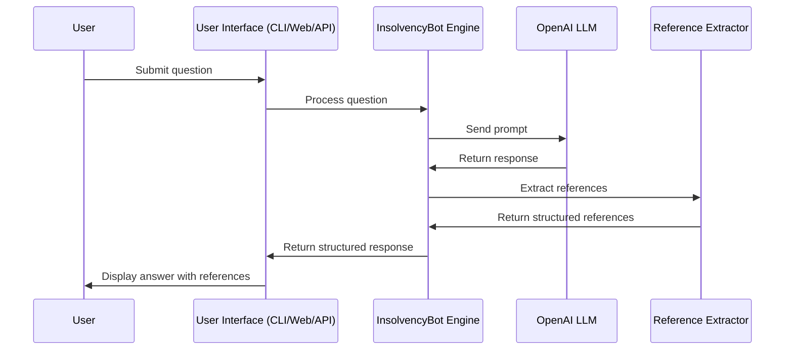
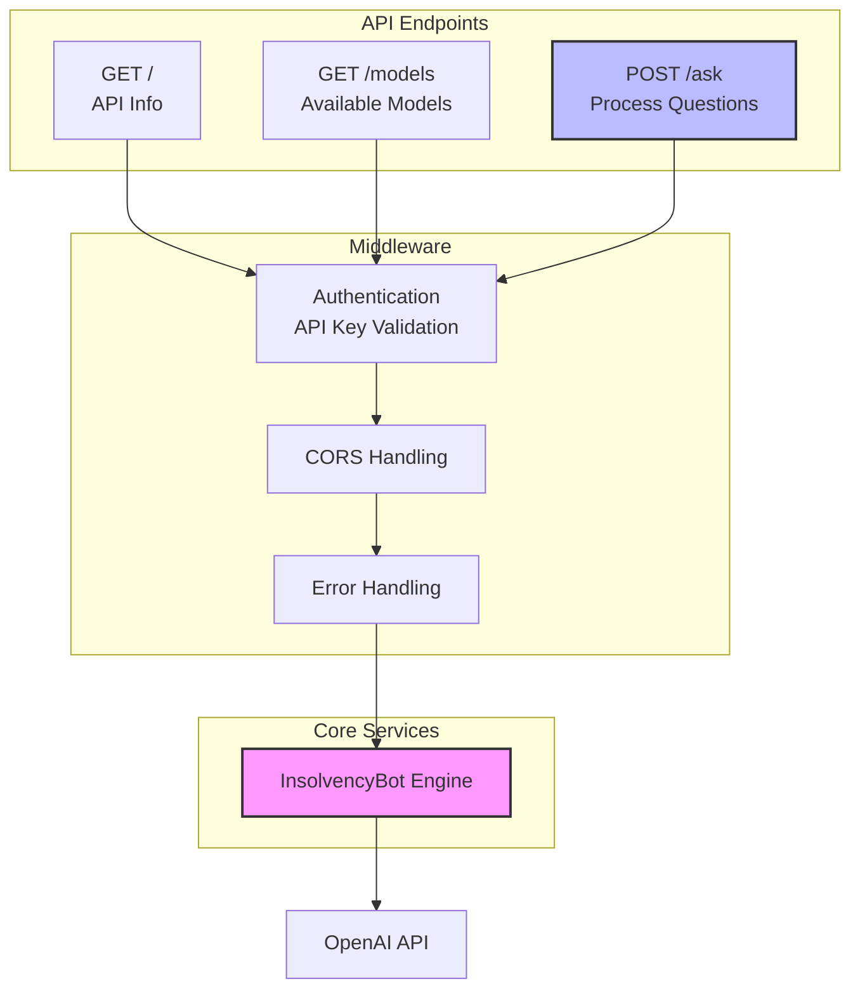
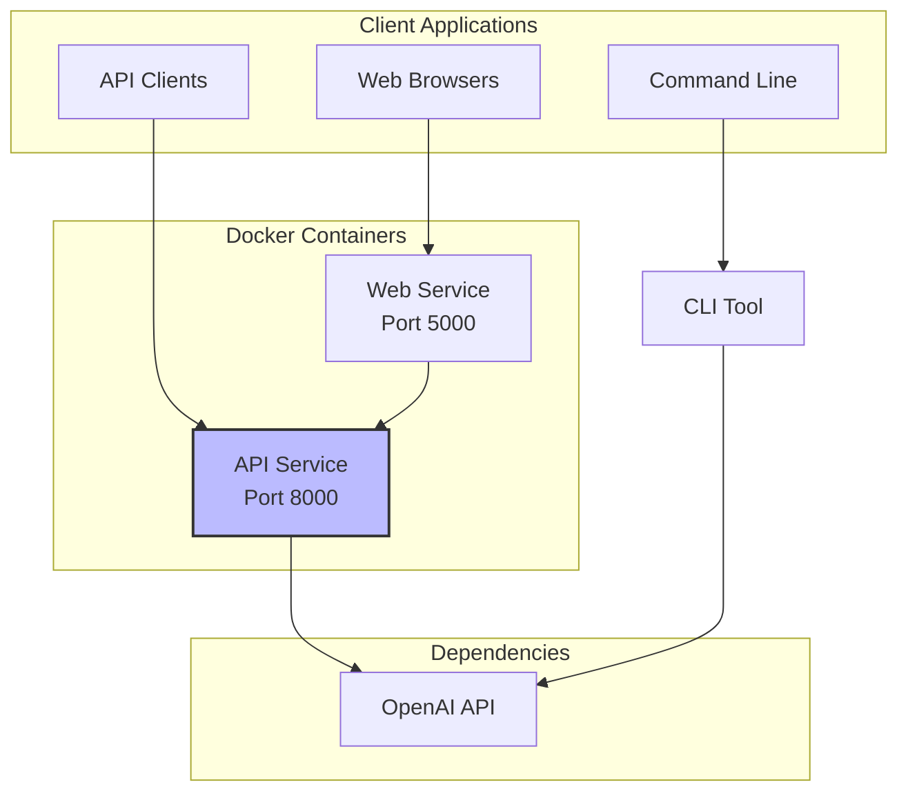

```mermaid
flowchart TB
    User[User] --> WebUI[Web Interface\n<i>app.py</i>]
    User --> CLI[CLI Interface\n<i>cli.py</i>]
    User --> ClientApp[Client Application]
    
    ClientApp -->|HTTP Requests| API[REST API\n<i>api.py</i>]
    WebUI --> Engine
    CLI --> Engine
    API --> Engine
    
    subgraph Core["InsolvencyBot Core"]
        Engine[InsolvencyBot Engine\n<i>insolvency_bot.py</i>] --> Prompt[Prompt Engineering]
        Prompt --> OpenAI[OpenAI API]
        OpenAI --> ResponseProc[Response Processing]
        ResponseProc --> RefExtract[Reference Extraction]
    end
    
    Engine --> StructuredResponse[Structured Response\n<code>{response, legislation, cases, forms}</code>]
    
    StructuredResponse --> WebUI
    StructuredResponse --> CLI
    StructuredResponse --> API
    API -->|JSON Response| ClientApp
    StructuredResponse --> CLI
    StructuredResponse --> API
    
    Benchmark[Benchmarking\n<i>benchmark.py</i>] -->|Performance Metrics| Engine
    
    subgraph Data
        TrainingData[Training Data]
        TestData[Test Data]
        Evaluation[Evaluation Scripts]
    end
    
    Evaluation --> Engine
    
    style Core fill:#f9f9f9,stroke:#333,stroke-width:2px
    style User fill:#d4f1f9,stroke:#333,stroke-width:1px
    style StructuredResponse fill:#e1f5c4,stroke:#333,stroke-width:1px
    style Data fill:#fdf7e3,stroke:#333,stroke-width:2px
```

## Sequence Diagram: Question Processing



## API Architecture



## Deployment Architecture


